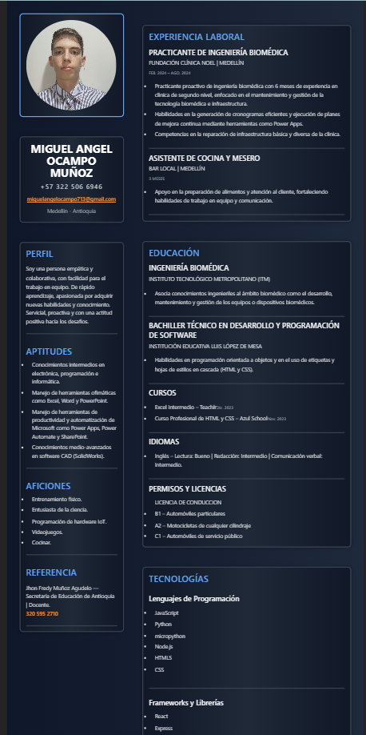

# Mi React Vite Miguel Angel Ocampo en React
# CV Miguel Angel Ocampo Muñoz
Este proyecto es una aplicación React donde presento mi información personal, habilidades, estudios y experiencia.

Vista general del proyecto

# Instrucciones para ejecutar el proyecto

1. Clonar este repositorio:

En tu terminal usa el comando 
"git clone https://github.com/miguelangelOcampo/cv-react-Miguel-Angel-Ocampo.git"

2. Configurar espacio para tu proyecto 
Entra a la carpeta he instala las dependencias con "cd nombre-proyecto". Luego instala las dependencias con "npm install", si trabajas con React.

3. Ejecuta tu proyecto
Usa "npm run dev" y ejecuta tu proyecto en el local host

# Historial de Commits y componentes

# Commits del 13 de Noviembre de 2025

* Creación de prop de componente Estudios y modificación pequeña a App  
  `0765fc9`

* Commit de creación, importación, exportación y desestructuración de props (Cabecera, Perfil, Experiencia)  
  `619a356`

* Creación de componente de foto de perfil y reestructuración de la hoja de vida con App.css  
  `e2c66fb`

* Creación de componente para Estudios y importación en App  
  `1bb69ab`

# Commits del 10 de Noviembre de 2025

* Creación de componente para Experiencia laboral y importación en App  
  `0fb331a`

* Creación de componente para el Perfil, ah importación a App 
  `1eabefa`

* Creación de componente para la cabecera, he importación en App  
  `10819c9`

* Commit inicial de carpeta y documentación con las dependencias de React y Vi 
  `38530e1`

